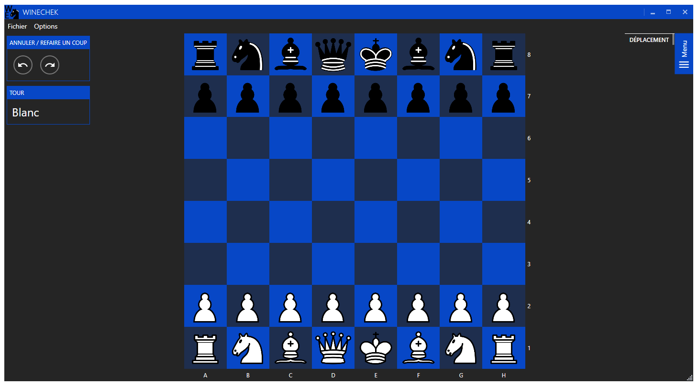

  

# WinEchek

WinEchek is a simple chess game in which you can play locally over the network with another player or against an [AI](https://github.com/official-stockfish/Stockfish).  

## Motivation
WinEchek was part of a semester long project for our second year at the University Institute of Technology of Dijon.
We have chosen to develop a chess game because it appeared to us as a complete exercice in adequation to our level.

## Setup
Simply clone the repository open it using Visual Studio and press <kbd>F5</kbd>.
